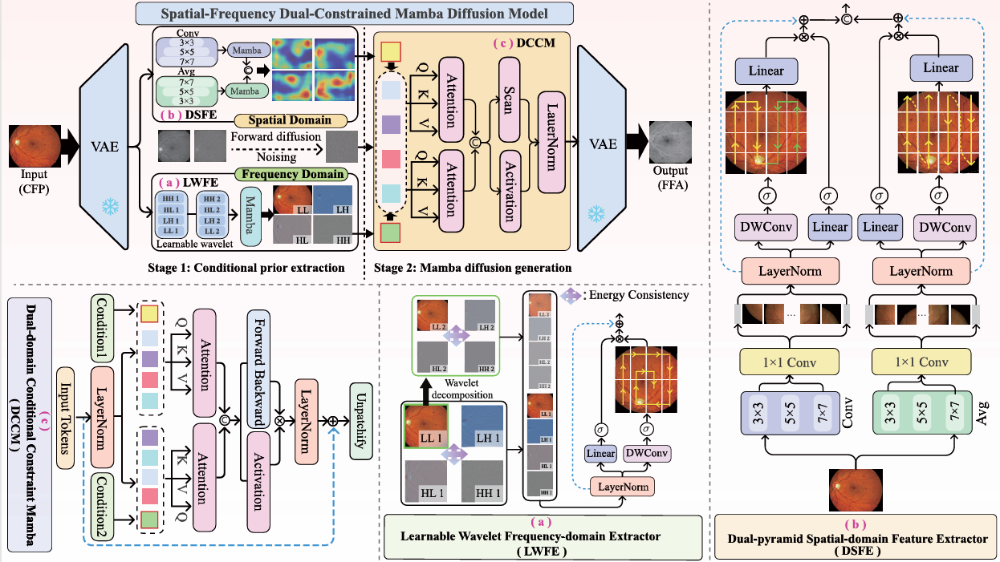

## SFDC-MambaDiff

## Spatial-frequency dual-constrained Mamba di usion model for cross-modal generation from CFP to FFA


> **Abstract:**  Fundus Fluorescein Angiography (FFA) is a critical imaging technique for visualizing retinal vascular dynamics and diagnosing various retinal pathologies. However, its reliance on intravenous fluorescein dye may pose risks of nausea, allergies, and even life-threatening complications, with potential adverse reaction hazards. To overcome these limitations, we propose a novel Spatial-Frequency Dual-Constraint Mamba Diffusion Model (SFDC-MambaDiff) for cross-modal generation of FFA images from non-invasive Color Fundus Photography (CFP). Specifically, we design a Learnable Wavelet Frequency-domain Extractor (LWFE) that integrates spiral Mamba scanning to capture frequency-domain vascular features, serving as structural priors. In parallel, a Dual-pyramid Spatial-domain Feature Extractor (DSFE) is developed by combining convolution and average pooling operations with row-column bidirectional scanning to model both global and local spatial representations, which serve as lesion-aware priors. These two domain-specific priors are further integrated through a Dual-domain Conditional Constraint Mamba module (DCCM), which employs a dual attention mechanism to guide the progressive denoising process of the diffusion model...

⭐If this work is helpful for you, please help star this repo. Thanks!🤗


## 📑 Contents

- [News](#news)
- [Installation](#installation)
- [Datasets](#Datasets)
- [Citation](#cite)


## <a name="Real-SR"></a> 🥇 The proposed SFDC-MambaDiff architecture


<p align="center">
    
</p>


## <a name="news"></a> 🆕 News

 The code is being uploaded. 😄


## <a name="installation"></a> Installation

This codebase was tested with the following environment configurations. It may work with other versions.

- CUDA 11.7
- Python 3.9
- PyTorch 1.13.1 + cu117
- NVIDIA 4090 GPU (24 GB) 

To use the selective scan with efficient hard-ware design, the `mamba_ssm` library is advised to install with the folllowing command.

```
pip install causal_conv1d==1.0.0
pip install mamba_ssm==1.0.1
```

## <a name="Datasets"></a> Datasets

The datasets used in our training and testing are orgnized as follows:

Hajeb：Diabetic retinopathy grading by digital curvelet transform

MPOS: Non-invasive to invasive: Enhancing FFA synthesis from CFP with a benchmark dataset and a novel network

## <a name="cite"></a> 🥰 Citation

Please cite us if our work is useful for your research.


